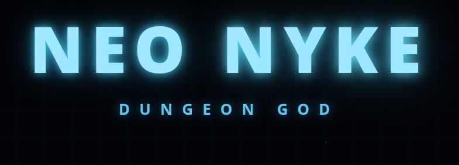

# NEO NYKE: DUNGEON GOD

A top-down roguelike dungeon crawler. Fight through 10 floors of procedurally arranged rooms, collect relics, upgrade your moves, and defeat the God boss.

## Characters

| Character | Style |
|-----------|-------|
| **Thorn Knight** | Starter. Bleed-focused melee fighter. |
| **Metao** | Wizard. Lower damage, compensated by range and fire/chaos abilities. |
| **Granialla** | Unlocked by beating the final boss. Healing-focused. |

## Controls

| Input | Action |
|-------|--------|
| `W A S D` | Move |
| `LMB` | Slash / melee attack |
| `RMB` | Beam attack |
| `R` | Smash |
| `Shift` | Mobility skill |
| `I` | Inventory |

Controls are fully remappable in Settings.

## Room Types

- **Combat** — enemy encounters
- **Shop** — buy items, weapons, moves, and heals with coins
- **Treasure** — chests with item drops
- **Anvil** — spend XP to upgrade weapons and moves
- **Challenge** — optional modifiers (No Hit, No Items, etc.)
- **Ladder** — exit to the next floor
- **Secret** — hidden rooms
- **Boss / God** — final floor encounters

## Systems

**Skills** — four slots (Melee, Laser, Smash, Mobility) each with independent cooldowns. Swap moves at Anvils and Shops.

**Status Effects** — Bleed, Fire, Poison, Dark Drain. Each has stacks, duration, and damage ticks.

**Relics** — passive items that persist through a run and modify your stats or abilities.

**Anvil Forge** — spend XP to permanently upgrade a weapon or move for the current run.

**Bank & Loop Crystals** — meta-progression currency carried between runs. Crystals unlock prestige challenges.

## Running the Game

Open `index.html` in a browser. No build step required.
